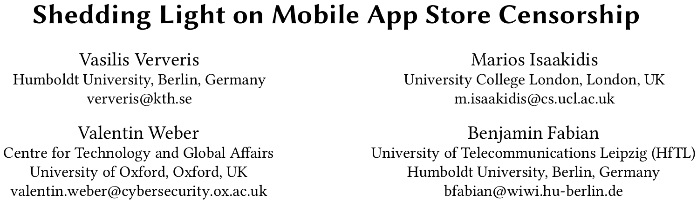
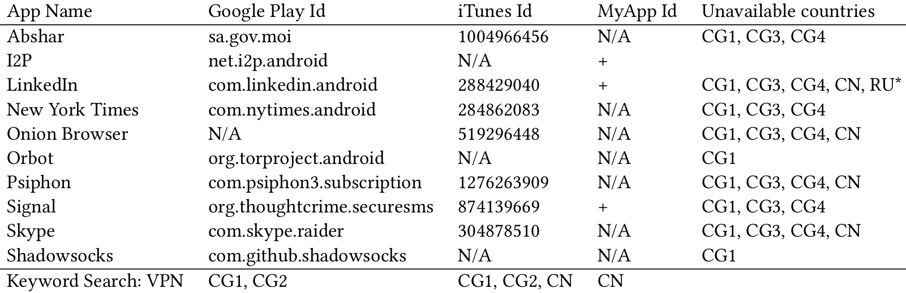
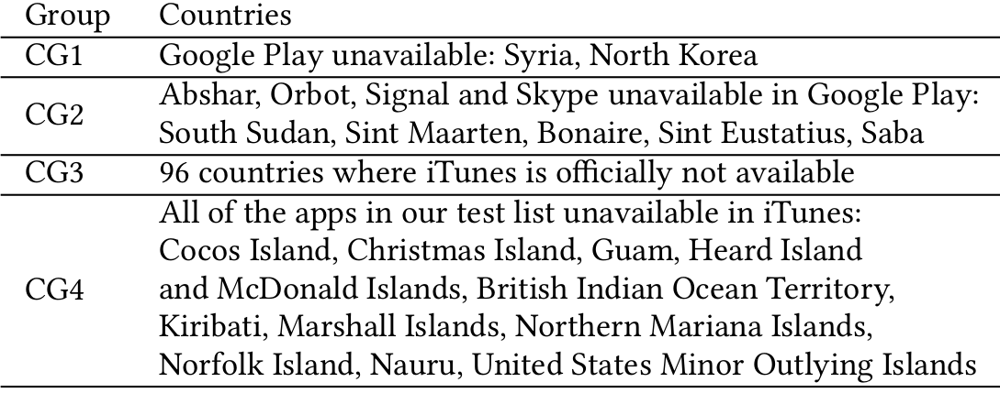

## Introduction
* Widespread adoption of apps

    -> Programs designed for mobile devices

Note:
It goes without saying that the widespread adoption of smartphones over the past
decade saw an extreme rise in the development, distribution and usage of mobile
applications.

## Uses
* Entertainment
* Banking
* Medicine
* Education
* Communication

## Main Goal
> Investigate the availability of apps in several app stores across different countries

## App Stores
* Android
    * Google Play
    * Tencent MyApp

* iOS
    * iTunes Store

Note: Google Play Store operated by Google LLC\
Tencent App Store operated by Tencent Holdings Ltd.\
Apple App Store operated by Apple Inc.

## App Store Operation Across Countries
Official country availability list:
*    iTunes Store
*    Google Play

Note: Currently we only take into consideration the Apple iTunes and Google Play
app stores, as they are the only ones with an official country availability list
on their websites, and since the Tencent MyApp store is primarily targeting
users in China.

## Google Play
* Available in 144 countries
* "Rest of the world"

Note: The actual countries included in the “Rest of the World” category, or at
least their number, is not publicly available.\
Does not clarify the reason why the Google Play Store is not operating in a
country; whether that is due to sanctions, regulations, or company and
in-country policies.\
By looking on the crawled app data for Google Play we found out that Play Store
is not available in Syria and North Korea (ISO 3360 country codes SY and KP).
That brings us to believe that Google Play Store is most probably not operating
in these countries, whereas in other countries with US sanctions we were able to
retrieve app information.

## Apple iTunes
* Available in 96 countries
* iTunes customer's support confirmed
    * No info on unavailable countries
Note: Officially not operating on an entire hemisphere\
More transparent\
Some restrictions may apply because of export restrictions. This is why stores
are not available in Iran, North Korea, and Syria for instance. In some
countries like Serbia, the Apple App Store is not available for legal or
commercial reasons.

## Unclear country availability
* Export restrictions ?
* Legal/commercial reasons ?
* US sanctions ?

Note: Due to practical matters, such as Apple not having a registered legal entity
in Serbia, or perhaps even because the sale would most likely be initiated in
foreign currency

## Methodology
App categories used:
* Censorship circumvention
* Anonymity
* Messaging
* Blocked/unavailable/controversial
* Keyword: VPN

Note: FLOSS\
In order to verify claims about blocked or otherwise unavailable apps in
different countries we added Skype (a widely used voice application), the New
York Times news app, LinkedIn social network app and the controversial Abshar
app developed by the government of Saudi Arabia.

### Querying App Stores
* Google Play
        https://play.google.com/store/search?c=apps&q={term}&gl={country}
        https://play.google.com/store/apps/details?id={Google Play Id}&gl={country}
* Apple App Store
        https://itunes.apple.com/search?term={term}&country={country}
        https://itunes.apple.com/lookup?id={iTunes Id}&country={country}
* Tencent MyApp
        https://android.myapp.com/myapp/searchAjax.htm?kw={term}
        https://android.myapp.com/myapp/detail?apkName={MyApp Id}

Note: The URLs for querying the app stores for a term and for the details of a
given application.
{term}: the search term, {Google Play ID/iTunes ID/MyApp ID}: the ID of the app
in each platform, {country}: the country code

## Findings

Note: An indicative list of queries for apps and keywords in different
countries. Includes app identifiers in each app store.  +: Same app ID with
Google Play, *: Unavailable in Google Play Store and Apple App Store, CG1-4:
Country Groups (see Legend: Country Groups)

Vertical:
### Legend: Country Groups

Note: Country Groups with regards to how and why they are censored

## Findings (2)
* Confirm new Chinese regulations:

    --> Ban "unlicensed" VPN providers
* LinkedIn unavailable in Google Play and iTunes in Russia

* Tencent App Store: VPN apps unavailable

Note: LinkedIn Russian government banned the company’s app and website [15].

## App Store Coverage
* ~50% Russia
    * Greater impact: Google Play
* ~30% China
    * Greater impact on iTunes & Tencent

Note: Censoring an app on Apple App store or Tencent App Store in China will
have a larger effect than on Google Play Store, which is barred from the market
in China [42].\
Similarly censoring an app from Google Play Store in Russia has a
greater effect than excluding an application from the Apple App store, due to
Google’s larger footprint within the country.

## Verifying methodology
* Same results across various vantage points
* OONI data confirm LinkedIn is unavailable on Google Play
   * 52 ASes of Russia
* Reproducible methodology
    * Tools and measurements available on:
        * https://github.com/hack66/appavail

Note: OONI data show that the LinkedIn app on Google Play Store was not
accessible (returned an HTTP Code 404).

## Monopoly of app ecosystems
* Lockout of 3rd party stores
* Easier for governments to block specific apps
* Financial profit:
    * User analytics monetization
    * Services Silo (self promotion)

Note: Justified as a security safeguard, because there can be no guarantees of
the validity of the applications distributed by independent app stores.

## 3rd party App Stores (+)
* Censorship circumvention
* Not enforce country-specific censorship
* Freedom to users and developers

    -> Healthy software ecosystem

## 3rd party App Stores (-)
* Void warranty
* Degrade device security
    * Install software from unknown sources
    + Jailbreak
* Unclear revenue models

## Thank you!

https://github.com/hack66/appavail

https://CyprusObservatory.org

                                Made with ♥ in Cyprus
